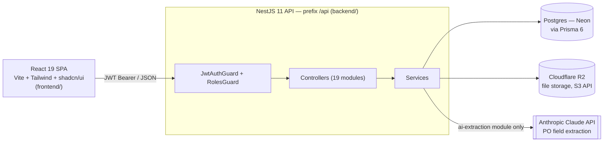
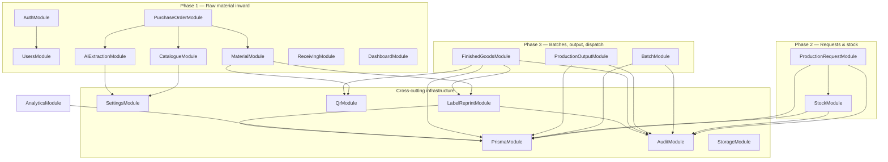
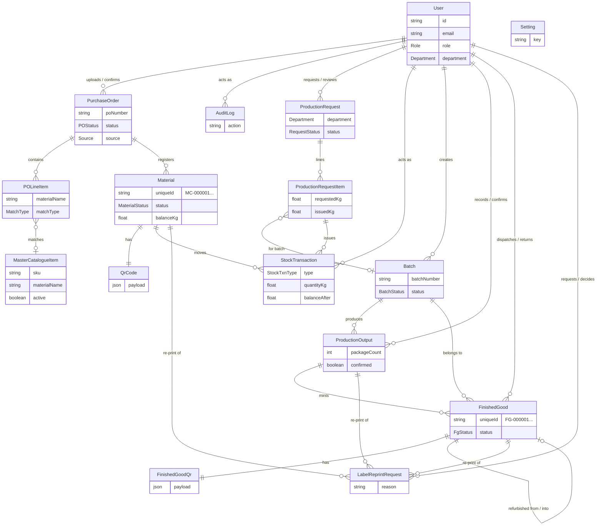
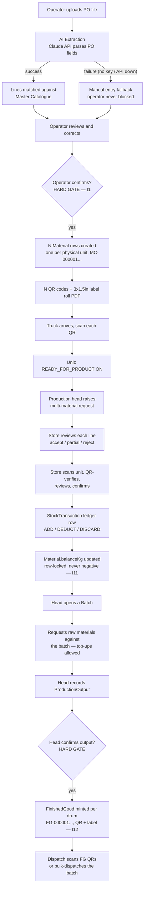
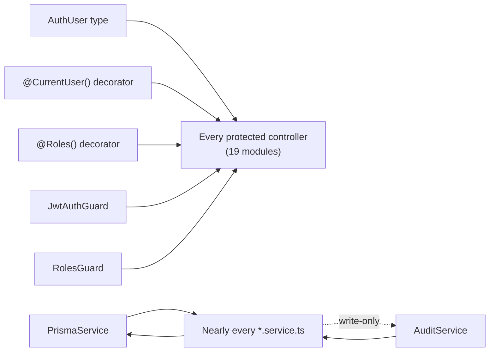
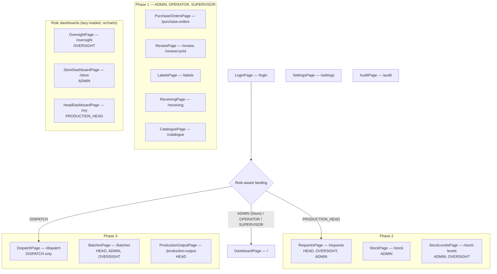

# Knowledge Graph — Modern Colours ERP

> **Purpose:** a visual map of the codebase for a developer or AI agent seeing this
> repo for the first time. Every diagram below renders natively in GitHub (Mermaid) —
> no tooling required, just open this file.
>
> **Companion doc:** [`KNOWLEDGE_GRAPH_REPORT.md`](./KNOWLEDGE_GRAPH_REPORT.md) — the
> narrative index (god nodes, subsystem table, navigation playbook).
> **Want to explore instead of read?** Open
> [`knowledge-graph-interactive.html`](./knowledge-graph-interactive.html) in a browser —
> a force-directed, zoomable, searchable graph of every module in the repo (152 labeled
> subsystems), click any node for its file, line count, and full import/imported-by list.
> **Source of truth for prose/invariants:** [`ARCHITECTURE.md`](./ARCHITECTURE.md) — this
> graph is derived from it plus a static-analysis pass over the code (see
> [Provenance](./KNOWLEDGE_GRAPH_REPORT.md#provenance--how-to-regenerate)).

---

## 1. System context

No Docker, no GraphQL. Database is hosted Neon Postgres (not local); file storage is
Cloudflare R2 with a local-disk fallback when R2 credentials are absent.

---

## 2. Backend module graph

19 NestJS modules, grouped by the phase they serve. Arrows are real `imports: []`
edges from each `*.module.ts` — this is the actual dependency graph, not a guess.

`AppModule` (`backend/src/app.module.ts`) is the root that wires all 19 modules
together plus `HealthController` — it isn't drawn above because every node in this
diagram is a child of it.

---

## 3. Domain data model (16 Prisma models)

`LabelReprintRequest` is polymorphic — it optionally references a `PurchaseOrder`,
`Material`, `ProductionOutput`, or `FinishedGood` depending on which label is being
reprinted, all behind an approval workflow (`label-reprint` module).

---

## 4. Material lifecycle — Phase 1 → 2 → 3

The single most important flow in the system. Every ⬦ is a **hard gate**: nothing
downstream happens without an explicit human confirm.

FIFO is **advisory, never blocking**: scanning a non-oldest unit warns and logs a
`FIFO_OVERRIDE` audit entry, but the operator may proceed (not shown above to keep
the happy path readable — see `ARCHITECTURE.md` §8).

---

## 5. Cross-cutting "god nodes"

Nodes with disproportionately many edges in the extracted call graph — the load-bearing
abstractions that touch almost everything.

All five auth primitives live in `backend/src/common/` (`auth/`, `guards/`,
`decorators/`) — that directory is the single point of change for anything touching
authentication or authorization. See the report for the full ranked list, including
the frontend-side god nodes (`cn()`, `toast()`, `useAuth()`, `Button`, `Card`).

---

## 6. Frontend route map by role

Role gates are UI convenience only — the real enforcement is server-side (`RolesGuard`
+ `@Roles()` on every controller), see `dispatch-isolation.spec.ts` and
`phase1-access.spec.ts`.

---

_Generated 2026-07-22. Regenerate after structural changes — see
[Provenance](./KNOWLEDGE_GRAPH_REPORT.md#provenance--how-to-regenerate)._
